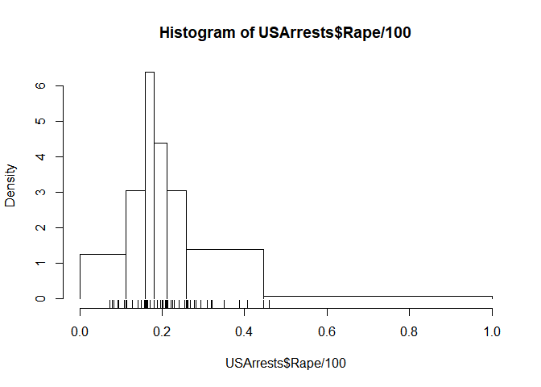

<!-- README.md is generated from README.Rmd. Please edit that file -->

# histogramr 

<!-- badges: start -->

[](https://travis-ci.org/JonasMoss/histogramr)
[](https://ci.appveyor.com/project/JonasMoss/histogramr)
[](https://cran.r-project.org/package=histogramr)
[](https://codecov.io/gh/JonasMoss/histogramr?branch=master)
[](https://www.repostatus.org/#wip)

<!-- badges: end -->

This is an `R` package for estimating [irregular
histograms](https://en.wikipedia.org/wiki/Histogram#Variable_bin_widths).
The intention is to:

1.  Implement some methods for selecting bin placement,
2.  Make the interface mimic `stats::hist` as closely as possible.

Currently the package estimates the optimal bin placements of irregular
histograms (given the number of break points) using either maximum
likelihood or L<sub>2</sub> minimization.

*Note:* This package is under development. The API and core features are
likely to change.

## Installation

Install the development from [GitHub](https://github.com/) with:

``` r
# install.packages("devtools")
devtools::install_github("JonasMoss/histogramr")
```

## Example Usage

Only data on the unit interval \[0, 1\] is supported.

``` r
library("histogramr")
histogramr(USArrests$Rape/100, breaks = 7)
rug(USArrests$Rape/100)
```


